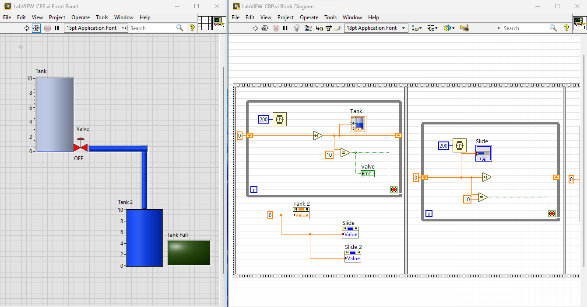
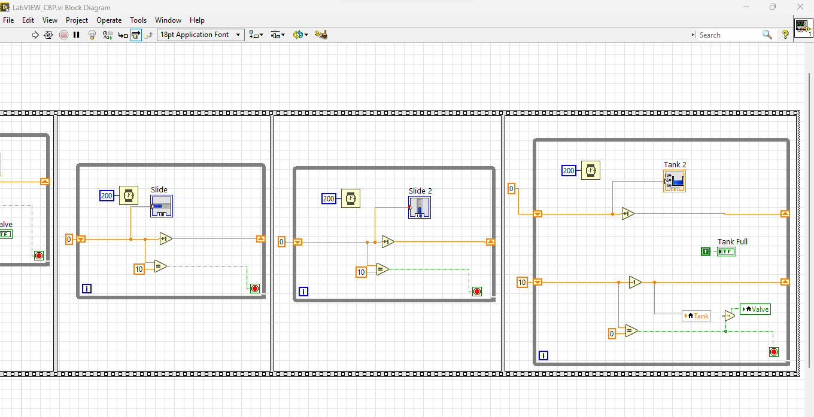

# 🚰 Automatic Tank Filling System (LabVIEW Project)

### 📌 Overview
This project demonstrates an **Automatic Tank Filling Process** using **NI LabVIEW**.  
It simulates **real-time monitoring** of water levels in two tanks with automatic valve actuation, overfill prevention, and user interaction via sliders and indicators.  

Developed as part of the **LabVIEW Programming Laboratory (B.Tech – EIE)** course.

---

## 🎯 Objectives
- Automate water transfer between two tanks.
- Prevent overfilling using threshold-based control.
- Provide interactive user control with sliders and emergency stop.
- Visualize process automation concepts in real-time.

---

## 🛠️ Features
- **Real-time simulation** of water filling and transfer.  
- **Valve Control**: Automatic ON/OFF based on Tank1 level.  
- **Tank Full Detection**: LED indication when Tank2 is full.  
- **User Interaction**: Sliders for flow rate and threshold.  
- **Emergency Stop**: Halts simulation at any point.  
- **Dynamic Visualization**: Front Panel shows tank levels and valve state.

---

## 📂 Repository Contents
- `main.vi` → LabVIEW simulation file.  
- `images/` → Front Panel & Block Diagram images.  
- `procedure.md` → Step-by-step procedure to recreate the project.  
- `README.md` → Project documentation (this file).  

---

## 📸 Screenshots

### 🔹 Front Panel

### 🔹 Block Diagram

---

## 📊 Results
- Successfully simulated **automatic tank filling** with correct valve actuation.  
- Real-time visualization of tank levels was achieved.  
- Overfill prevention logic worked as expected.  
- Sliders allowed **dynamic adjustment** of flow rate and threshold.  

---

## 🔮 Future Scope
1. Integration with **real hardware sensors & valves** via NI-DAQ or Arduino.  
2. Implementation of **PID control** for precise regulation.  
3. IoT-enabled **remote monitoring and control**.  
4. **Data logging & analytics** for fault detection.  
5. Expansion to **multi-tank systems** and SCADA integration.  

---

## ▶️ How to Run
1. Open `main.vi` in **NI LabVIEW (any recent version)**.  
2. Set **Flow Rate** and **Threshold** sliders.  
3. Run the VI:
   - Tank1 fills → Valve opens at threshold → Tank2 fills.  
   - When Tank2 reaches full → `Tank Full` LED lights up.  
4. Press **Stop** anytime to end the program.  

👉 For a detailed build guide, see [procedure.md](procedure.md).  

---

## 👨‍💻 Authors
- **B. Shasheendra**  
---

## 📜 License
This project is for **academic and learning purposes**.  
---
